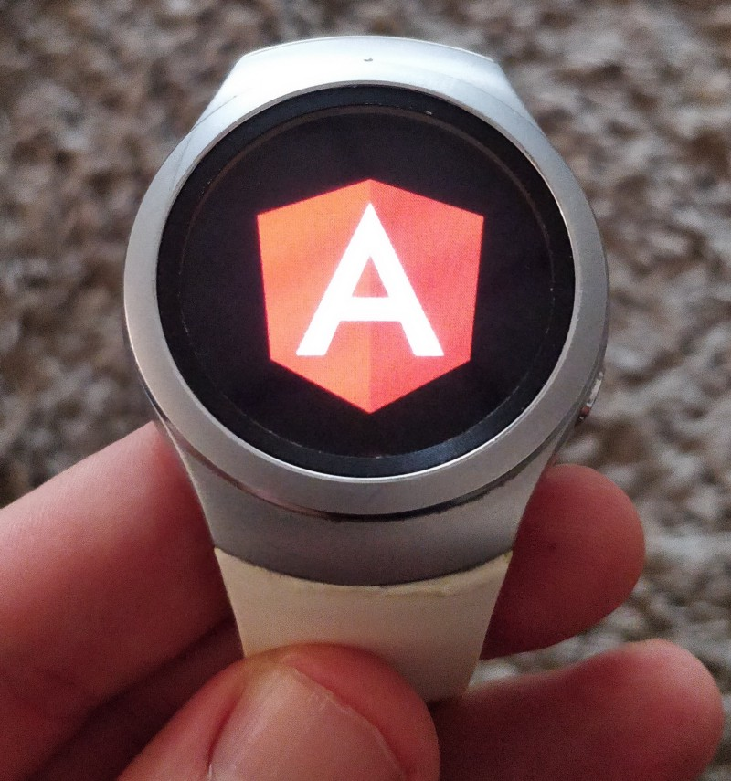
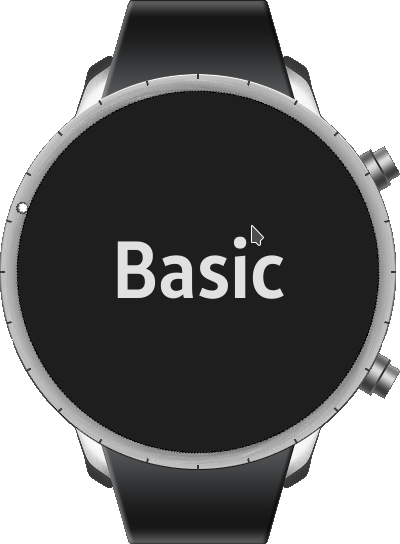
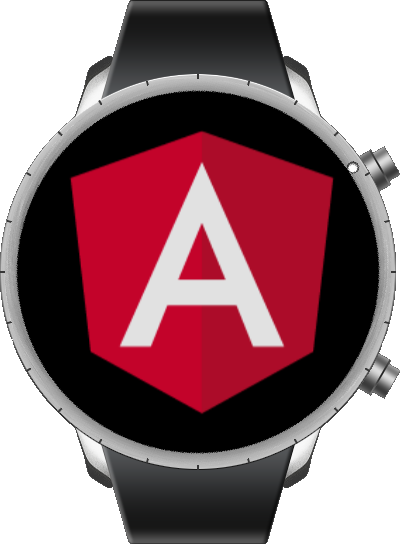

Time for some code obscura. I own a Samsung Gear S2 watch, which at this
point is getting 3 years old. The newer models still use the same [Tizen
SDK](https://developer.tizen.org/),
so anything laid out here should work with those devices as well.

I had a small app in mind for the watch, but I didn’t like my options.
Development for the watch can be done with either native C or as an Web
application i.e. Vanilla JavaScript. There’s also Visual Studio
extensions also added lately with .NET support. C is, well, C and JS
gives me a vitriolic reaction.

So that got me thinking, Angular while being
Typescript is in the end just Javascript, it should work right? And sure
enough it does. Let’s kick things of with a simple POC and make
everything from scratch.

To go through the sample you need the [Tizen
SDK](https://developer.tizen.org)
(including the Command Line tools), and the [Angular
CLI](https://cli.angular.io/)

### Step 1: Creating an Angular project 

First let’s create a new Angular 6 project and try it out:

``` 
cd ~/git/
~/git/$ ng new angularTizenSample
~/git/$ cd angularTizenSample
~/git/$ ng serve
```

If everything went smoothly, you should see the Angular sample project.
You can stop that, and let’s move on to the Tizen project.

### Step 2: Creating a Tizen Web Project 

The Tizen Studio is a bit flaky, so we’ll be using the command line
tools to create a Tizen Web Project. Assuming you have the Tizen watch
emulator up and running, let’s create a new project inside the Angular
project and launch it:

``` 
~/git/angularTizenSample/$ tizen create web-project -p mobile-2.3.1 -t WebBasicApplication -n angularTizenSample
~/git/angularTizenSample/angularTizenSample/$ cd angularTizenSample
~/git/angularTizenSample/angularTizenSample/$ tizen build-web
~/git/angularTizenSample/angularTizenSample/$ tizen package -t wgt -- .buildResult/
~/git/angularTizenSample/angularTizenSample/$ sdb install .buildResult/angularTizenSample.wgt
~/git/angularTizenSample/angularTizenSample/$ sdb shell  "wrt-launcher '-s Bsl3EwnDc9.angularTizenSample'"
```

That Bsl3EwnDc9.angularTizenSample is the application ID. It was created
into the config.xml file.



The basic project on the Tizen Emulator
From this project, we need the icon which we will move into src/assets,
config.xml and .project files. We can delete everything else and rename
this directory to simply “tizen”

### Bridging the Gap 

Next, let’s alter the Angular project to accommodate the watch (some
WebKit based) — let’s enable all polyfills in *polyfills.ts*:

``` 
import 'core-js/es6/symbol';
import 'core-js/es6/object';
import 'core-js/es6/function';
import 'core-js/es6/parse-int';
import 'core-js/es6/parse-float';
import 'core-js/es6/number';
import 'core-js/es6/math';
import 'core-js/es6/string';
import 'core-js/es6/date';
import 'core-js/es6/array';
import 'core-js/es6/regexp';
import 'core-js/es6/map';
import 'core-js/es6/weak-map';
import 'core-js/es6/set';
```

Next, to see everything works let’s modify the project so that it simply
shows the Angular logo and if you press on it, it changes to the Tizen
logo.

Let’s grab an [Angular
logo](https://angular.io/presskit)
and replace the inlined one and place it into assets as *angular.png*
and take the *icon.png* from the tizen project and place it as
tizen.png.

*app.component.html*:

``` 
<div style="text-align:center">
  
</div>
```

*app.component.ts:*

``` 
import  from '@angular/core';

@Component({
  selector: 'app-root',
  templateUrl: './app.component.html',
  styleUrls: ['./app.component.css']
})
export class AppComponent {
  title = 'angularTizenSample';
  angular = 'assets/angular.png';
  tizen = 'assets/tizen.png';
  img = this.angular;

  changeImage() {
    if (this.img === this.angular) {
      this.img = this.tizen;
    } else {
      this.img = this.angular;
    }
  }
}
```

### Updating the Build Files 

Let’s update the build files so that a simple
`npm run tizen `command will build
everything and create the Tizen package for us:

Lets include all the configuration files for Tizen in *angular.json:*

``` 
{
  "$schema": "./node_modules/@angular/cli/lib/config/schema.json",
  "version": 1,
  "newProjectRoot": "projects",
  "projects": {
    "angularTizenSample": {
      "root": "",
      "sourceRoot": "src",
      "projectType": "application",
      "prefix": "app",
      "schematics": ,
      "targets": {
        "build": {
          "builder": "@angular-devkit/build-angular:browser",
          "options": {
            "outputPath": "dist/angularTizenSample",
            "index": "src/index.html",
            "main": "src/main.ts",
            "polyfills": "src/polyfills.ts",
            "tsConfig": "src/tsconfig.app.json",
            "assets": [
              "src/favicon.ico",
              "src/assets",
              
            ],
            "styles": [
              "src/styles.css"
            ],
.....
```

Build commands in *package.json:*

``` 
{
  "name": "angular-tizen-sample",
  "version": "0.0.0",
  "scripts": {
    "ng": "ng",
    "start": "ng serve",
    "build": "ng build --prod",
    "test": "ng test",
    "lint": "ng lint",
    "e2e": "ng e2e",
    "tizen": "npm run build && npm run tizenPackage",      "tizenPackage": "cd dist/angularTizenSample && tizen build-web && tizen package -t wgt -- .buildResult/",
    "tizenRun": "cd dist/angularTizenSample && sdb install .buildResult/angularTizenSample.wgt && sdb shell  \"wrt-launcher '-s Bsl3EwnDc9.angularTizenSample'\""
  },
  "private": true,
```

No we can `npm run tizen` to package our
app and `npm run tizenRun` to start it on
the emulator (or device, depends what sdb points to):




Angular on the emulator
Running on an actual device you only need to follow the standard Tizen
instructions — namely create a certificate, install it on your device
and sign the wgt file. 

### Whats Next? 

The next step would be to use the [Tizen
API](https://developer.tizen.org/ko/development/api-references/web-application?redirect=/dev-guide/4.0.0/org.tizen.web.apireference/html/device_api/mobile/tizen/tizen.html){.markup--anchor
.markup--p-anchor} to interact with the device functionality, such as
button presses and bezel rotations. I created TypeScript interfaces for
this and mocked these calls and almost fully run the app on the browser
before even trying on the emulator/device.

Angular really shines when you hide the rather convoluted Tizen API
related to phone communications under a service an simple offer a
service for this functionality.

### Notes 

-   Debugging? You can use the Tizen Studio to start the project and
    even debug it from there, but as I said, it’s a bit flaky. The IDE
    freezing and various errors are abound. You can also attach to the
    Web Inspector of the version that was started from the command line.
-   Routing doesn’t work — everything needs to be in index.html.
-   Performance is adequate, on par with regular JS apps.

Code from this sample can be found at
<https://github.com/ration/angularTizen>.

Thanks for reading! Leave questions or comments below or contact me on
[Github](https://github.com/ration/).

By [Tatu Lahtela](https://medium.com/@lahtela) on
[September 28, 2018](https://medium.com/p/cd7d788fef95).

Originally posted on [Medium](https://medium.com/@lahtela/writing-a-tizen-watch-application-with-angular-6-cd7d788fef95)

