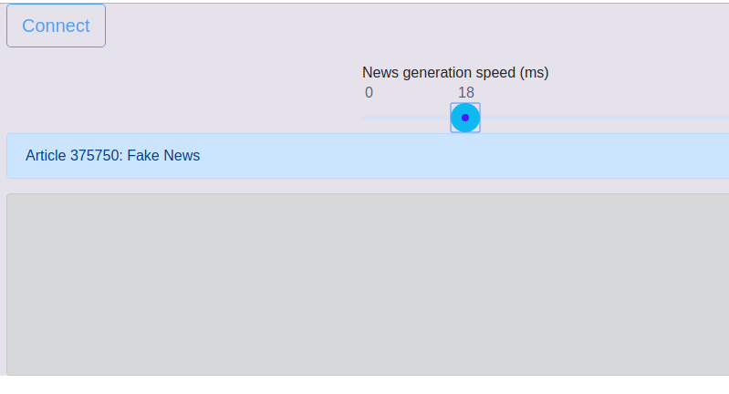

Do you have some kind of streaming source of data in your application?
Notifications? Tweets? Messages? What happens if that source starts to
produce data faster than your application can handle?
<!--more-->


on [Unsplash](https://unsplash.com/search/photos/dam?utm_source=unsplash&utm_medium=referral&utm_content=creditCopyText)](dam.jpg)

In [Reactive programmin](http://reactivex.io/)g when the client cannot
handle the amount of data produced by the observable it is called
[Backpressure](http://reactivex.io/documentation/operators/backpressure.html).
If these concepts are not familiar, head to [What is Reactive
Programming](https://medium.com/@kevalpatel2106/what-is-reactive-programming-da37c1611382)
by [Keval Patel](https://medium.com/u/dce15297d516) to get you up to
speed.

Let’s visualize backpressure with an Angular application that connects
to a Spring back end using [RSockets](http://rsocket.io/). They allow
you to get a reactive stream through the network layer with backpressure
support.

Then we’ll create a Rx operator that can control the data flow during
backpressure so the client, in this case the browser, receives less data
because of it.

Our example: a News Ticker.

### The Ticker

Let’s say there’s a news ticker that contains some very important news.
It chugs along at the speed events unfold in the world. The user looks
at the stream and pauses the ticker and reads some item in detail. When
the user is done, the ticker resumes where it left off.

OK this is the spec. I know you have some clarifying questions but the
PM is long gone. This is all we have.

To the drawing board. First a data object for the news items:




News items has some short description (headline), the article text and
whether it is breaking news.

A minimal API for the provider could look something like this if we were
to implement this non reactively:

``` 
interface NewsProvider {
    fun getNews(fromId: Int?, 
                breakingOnly: Boolean, 
                limit: Int = 100): List<News>
}
```

This API could be implemented RESTfully for the client. The client can
then use this to get the initial list, and then poll for more when the
ticker runs out.

On a slow news day it polls hopelessly at the end of the list for more
items. If something crazy happens like an orange sociopath is given
nuclear launch codes [without
restraint](http://blog.nuclearsecrecy.com/2016/11/18/the-president-and-the-bomb/)
and the ticker has always more data that the client can handle. Then
it’s up to the client to either leave forever behind or always simply
fetch the latest data and perhaps filter by priority.

#### Going reactive

While this would probably work, it has one glaring problem: polling. If
it’s critical that the feed is delivered as fast as possible, we would
need to set the polling time interval short and strain the server.

So let’s get reactive. Let’s provide the same data, but this time with a
reactive interface:

```
interface NewsProvider {
 fun news(): Flowable<News>
}
```

The client uses the
[*Observable*](http://reactivex.io/documentation/observable.html)
(Flowable type is the backpressure supported type in RxJava2) to read
*News* at the pace they appear from the server and they’re immediately
shown on the ticker.

But we can’t just push the feed through the socket. What happens if the
ticker is paused for longer and the feed is swamped by the orange
menace? This is where
[backpressure](http://reactivex.io/documentation/operators/backpressure.html)
kicks in. If the server has news to give but the client can’t handle
them at the moment, we need to specify a strategy to handle this. In
this case a reasonable solution would be to buffer some of them, and if
that’s filled start dropping them.

Lets’s create a more dynamic solution so that when backpressure occurs
the feed is filtered to only contain breaking news for a period of time.

Ok enough with the rambling, show me the code\!

### Backend Implementation

Let’s start by creating the RSocket endpoint for the client (if your not
familiar with Kotlin, a Java version without the operators and in
Reactor 3 can be found
[here](https://github.com/ration/ticker-demo-java)):



RSocket endpoint for news

Here we create the RSocket end point (line 10) and start listening to a
port on a WebSocket and relay the *NewsProvider* news Flowable directly
into the socket as JSON (line 30).

We need an implementation for the *NewsProvider* interface we defined
above, so let’s implement a *FakeNewsGenerator* generator source for it:



Here we have a *source* that simulates some external source where the
news are coming from. In our case *source* is simply an interval
Flowable that churns news fake news at defined intervals.

If you look at the *news()*method (line 33) there’s a custom operator on
the Flowable called *onBackPressureFilter .* It has a duration parameter
and a lambda parameter for the filter in case of backpressure — show
only breaking news.

This is our own extension function:



We first lift our own operator *BackPressureFilterOperator* into the
stream and then use the standard Rx Operator
[*onBackpressureBuffer(capacity, onOverflowAction,
overflowStrategy)*](http://reactivex.io/RxJava/2.x/javadoc/io/reactivex/Flowable.html#onBackpressureBuffer-long-io.reactivex.functions.Action-io.reactivex.BackpressureOverflowStrategy-)
** to invoke our *handleBackPressure* method if backpressure occurs.

Writing operators for RxJava 2 is a [daunting
task](https://github.com/ReactiveX/RxJava/wiki/Writing-operators-for-2.0).
You get to jump into the deep end of the pool if you do it. There’s
sharks with lasers in the pool too. I read that guide multiple times and
I may have even understood it, who knows.

I opted not to implement the drain algorithm (or use stuff inside the
internal package) to detect backpressure in my own operator and opted to
use the default
[*onBackpressureBuffer*](http://reactivex.io/RxJava/2.x/javadoc/io/reactivex/Flowable.html#onBackpressureBuffer-long-io.reactivex.functions.Action-io.reactivex.BackpressureOverflowStrategy-)
** instead to invoke the action. Influencing an operator from another
feels like the sharks have their laser sights on me, but it should work.

Here’s the operator in its entirety for the curious:



It simply uses the backpressure action signal to enable the filter. The
rest is to conform (I hope\!) to the rules required for Rx operators. In
our case this means remember to request more data from upstream if we
filter elements and to stop doing anything if the stream has completed.

If you want your own strategy for backpressure, you might be better of
to simply use the *onBackPressureBuffer* action call and act accordingly
in your observable producer code.

### The Client

The client is rather straight forward, it merely connects to the
WebSocket and implements the Ticker requirements.

Here is the UI in all it’s glory
([Dilbert](https://dilbert.com/strip/2002-09-24) would be
proud):



Sorry, I didn’t have time to make it pretty. The UI allows us to connect
to the back end and view the news stream. You can also use the slider to
modify the fake news generator speed. If you click on any item and the
ticker stops and resumes if you click again.

Depending on the speed of your computer sliding down the generator
interval at some point backpressure will kick in and only red breaking
news are let through, or if you pause the ticker for long enough.

The most relevant part is the ticker service that connects to the back
end, I’ll put that in it’s entirety here as well:

On line 43 we create the RSocket for the connection and define the
connection to use WebSockets and request a stream (line 68).

The most interesting parts are perhaps the subscription phase (line 81)
for the RSocket — to control the flow speed we only request one item
from upstream and then another when we receive data (*onNext*, line 75).
Usually this number would be much higher or even unbounded
(MAX\_STREAM\_ID).

I noticed that if the speed is too much for the client (browser) to
handle, the WebSocket blocks and the connection dies on the back end
side to a *OutOfDirectMemoryError.*

### Final Thoughts

RSockets look really promising in general, but here I just highlighted
the backpressure aspects of them. Reactive streams through the network
layer feel rather awesome.

The full source can be found at
[github](https://github.com/ration/ticker-demo). The java version
[here](https://github.com/ration/ticker-demo-java) (without the
operator, simply filtering in the producer).

I’m really interested in your thoughts about this, so leave them below,
thanks\!

Originally posted on [Medium](https://medium.com/@lahtela/dynamic-flow-control-during-backpressure-with-rxjava-and-rsockets-41e369cda122)


