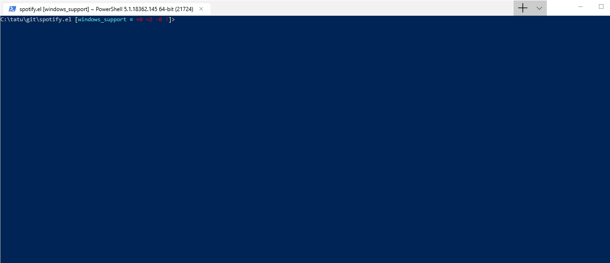

[Beyond Compare](https://www.scootersoftware.com/index.php) is a classic comparing tool for folders and files. But when you follow the [instructions](https://www.scootersoftware.com/support.php?zz=kb_vcs) and set up bc4 as your compare/merge tool, it opens all diffs in a separate window and one by one. This is slow and tedious, so it's better to set it up so that it opens a single window and all the changed files in tabs.

## Basic setup

Here is the basic setup as per [instructions](https://www.scootersoftware.com/support.php?zz=kb_vcs) (Windows):

```sh
git config --global diff.tool bc
git config --global difftool.bc.path "c:/Program Files/Beyond Compare 4/bcomp.exe"
git config --global difftool.prompt false
```

I'll also switch the tab order to make the changed file more visible in the tabs:

```
git config --global difftool.bc.cmd '\"c:/Program Files/Beyond Compare 4/bcomp.exe\" \"$REMOTE\" \"$LOCAL\"'
```


Then well add a new git command `diffall`. So open your git installation directory and go to cmd dir: e.g. `C:\Program Files\Git\cmd\`

Create a new file called _git-diffall_ (no extension):

```sh
#!/bin/sh
 git diff --name-status | grep "^M" | awk '{ print $2; }' | while read filename; do
    git difftool "$@" --no-prompt "$filename" &
done
```

You may need Administrator privileges to create that file.

Now you can use diffall to open a single session of bc4



