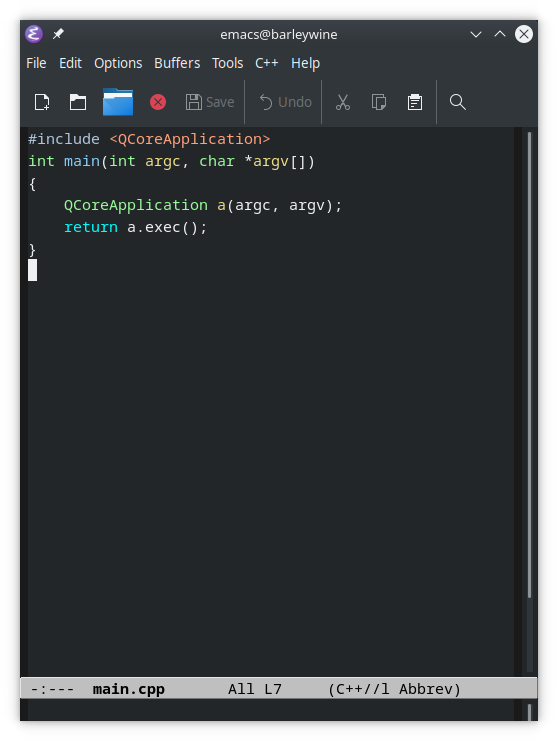
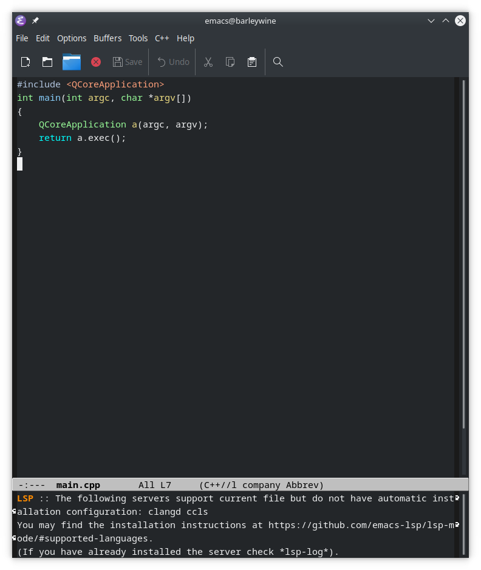
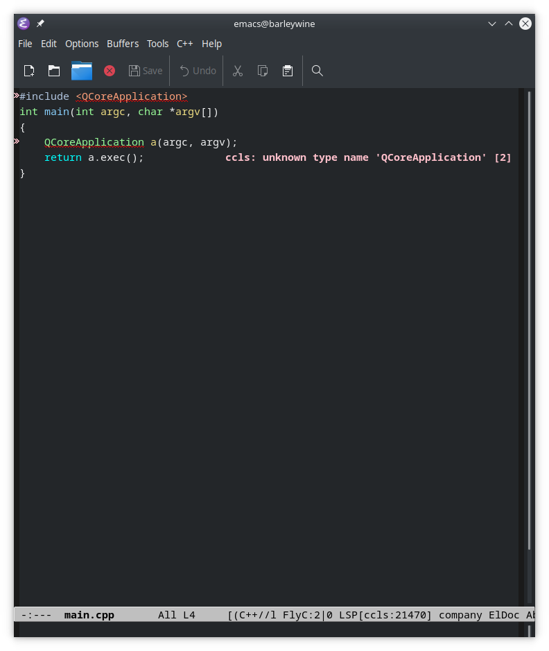
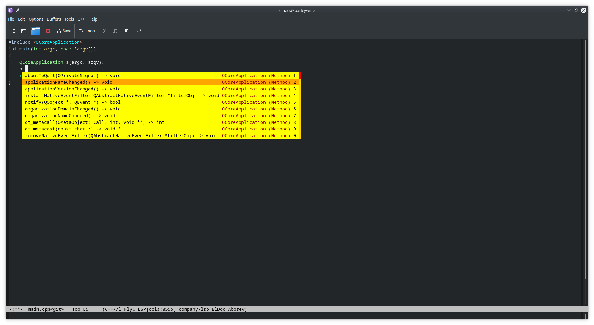

Ok starting with vanilla Emacs out of the box on Ubuntu, what does it take to setup to
have a decent development experience?

To start let's create a minimal Qt Project.

main.cpp:

```c++
#include <QCoreApplication>
int main(int argc, char *argv[])
{
    QCoreApplication a(argc, argv);
    return a.exec();
}
```

Let's just use QMake for compilation, so this would just be:

```
$ qmake -project
$ qmake
$ make
g++ -c -pipe -O2 -Wall -W -D_REENTRANT -fPIC -DQT_DEPRECATED_WARNINGS -DQT_NO_DEBUG -DQT_GUI_LIB -DQT_CORE_LIB -I. -I. -isystem /usr/include/x86_64-linux-gnu/qt5 -isystem /usr/include/x86_64-linux-gnu/qt5/QtGui -isystem /usr/include/x86_64-linux-gnu/qt5/QtCore -I. -I/usr/lib/x86_64-linux-gnu/qt5/mkspecs/linux-g++ -o main.o main.cpp
g++ -Wl,-O1 -o hello main.o   /usr/lib/x86_64-linux-gnu/libQt5Gui.so /usr/lib/x86_64-linux-gnu/libQt5Core.so /usr/lib/x86_64-linux-gnu/libGL.so -lpthread   
$ ./hello 

```

So what does this look like in emacs?



Huh, I was expecting Emacs to be white by default. Emacs picks up something default from
the underlying theme?

For some, this would be enough. Heck it *was* enough for me for years. You can compile,
debug with GDB, set breakpoints (`C-x c-a c-b`) etc. What more do you want?

Yeah right, that fancy stuff like completion.

## LSP

Enter [lsp-mode](https://github.com/emacs-lsp/lsp-mode). It is a *client* for LSP, [Language
Server Protocol](https://github.com/Microsoft/language-server-protocol/). What does that
mean? It means that there is a server running somewhere that looks at your code, compiles
and analyzes it, translates this data into a common format and provides it to clients such
as Emacs or VSCode to display ontop of the source code file.


To make things a bit more confusing `lsp-mode` in Emacs sometimes provides the server part
which makes whole operation is completely transparent. Sometimes it will prompt you to
install some external language server tool so that it can start it when
necessary. Sometimes there's a lot of configuration to be done before it consents to doing
anything.

But let's start with LSP. Let's install it MELPA (we need to add it as a source
first). Let's also use `use-package` so that things won't immediately turn into a mess:

MELPA and `use-package`.
Let's also lsp-mode along with company to show us errors and completions etc.
```emacs-lisp
(require 'package)
(setq package-enable-startup nil)
(add-to-list 'package-archives
             '("melpa" . "https://melpa.org/packages/"))
(package-initialize)
(unless (package-installed-p 'use-package)
  (package-refresh-contents)
  (package-install 'use-package))

(use-package company
  :ensure t
  :config
  (setq company-show-numbers t)
  (setq company-tooltip-align-annotations t)
  (setq company-tooltip-flip-when-above t)
  (global-company-mode))

(use-package company-quickhelp
  :ensure t
  :init
  (company-quickhelp-mode 1)
  (use-package pos-tip
    :ensure t))

(use-package lsp-mode :ensure t)
(use-package lsp
  :ensure lsp-mode
  :config
  (require 'lsp-clients)
  (add-hook 'lsp-after-open-hook 'lsp-enable-imenu)
  :init
  (setf lsp-eldoc-render-all nil)
  (setq lsp-inhibit-message t)
  (setq lsp-message-project-root-warning t))

(use-package lsp-ui :ensure t :commands lsp-ui-mode)
(use-package ccls
    :ensure t
    :hook ((c-mode c++-mode objc-mode cuda-mode) .
         (lambda () (require 'ccls) (lsp))))

 (use-package company-lsp :ensure t)
```

If you run reload the main.cpp file or run `lsp` while in it you'll be greeted with this:



The provided link will land you to the home page of `lsp-mode` which is less than
helpful. But it does say that either `ccls` or `clangd` server will support a cpp file. It
leaves up to you to figure out which you want and that they are external applications.

Let's go with ccls, so we well need to `apt install ccls`

After this if we reopen (or run `lsp` our main.cpp we will be greeted with errors:


Almost! The final thing missing is to have a [Compile Commands](https://github.com/MaskRay/ccls/wiki/Project-Setup#compile_commandsjson) json file for ccls, otherwise none of the includes work.

For this, we can use [Bear](https://github.com/rizsotto/Bear), so `apt install bear`

Then on the directory where we have our project:
```bash
$ make clean # (make sure it compiles)
$ bear make
```

This creates the required compile_commands.json. Reload ..and..the error doesn't budge. Hmm.

Time to debug. Let's look at what `*ccls::stderr*`buffer says.

First line:
```
19:42:31 ccls           initialize.cc:262 I initialize in directory /home/lahtela/tmp with uri file:///home/lahtela/tmp
```

That doesn't look right, my sample is in `/home/lahtela/tmp/hello`. There's some file
in tmp that makes ccls detect it as the project root directoy. Maybe .ccls-cache, [none of the files listen in the FAQ are there anyway](https://github.com/MaskRay/ccls/wiki/FAQ#project-root-detection). Let's move our sample somewhere else.

That's better, no errors!



Success! Now we have all that completion goodness. For me this is pretty much enough. You can get an even bigger IDE like with things like `treemacs`. 

As a general observation it's the server implementation that contains the more detailed usage instructions, not `lsp-mode`. For C++ for example look at the [ccls lsp-mode instructions](https://github.com/MaskRay/ccls/wiki/lsp-mode).


